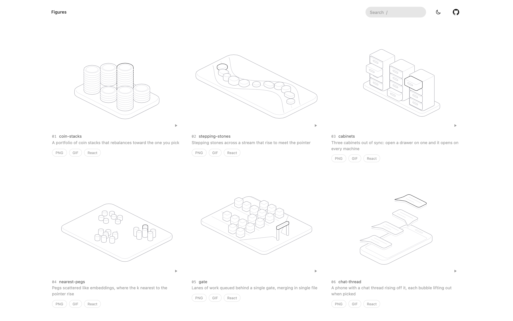

# Hairline figures

A library of interactive isometric line figures in the style of
[`@lucasmarkes/hairline`](https://lucasmarkes.com/lab/hairline): rounded solids drawn in a
single stroke, each one answering the pointer. Every figure ships as plain JS, a React
component, and light and dark GIFs.



Open `figures/index.html` straight from disk to see them all. Each card has its own play
button and three pills: **PNG** (drawn in the browser from the figure as it stands), **GIF**
and **React** (the component source, with Copy and Download).

## Layout

```
figures/
  <name>.js          figure sources, the only .js files at this level
  gallery.json       the registry: number, name and prompt of every figure
  index.html         the gallery page (generated)
  react/<Name>.tsx   one self-contained React component per figure (generated)
  gif/<name>.gif     light and dark GIFs, <name>-dark.gif (generated)
  build/             scratch output of the checks (git-ignored)
  archive/           retired figures, read by nothing
scripts/             the build and export scripts
docs/gallery.png     the screenshot above
```

The engine (`kernel.js`) is not in this repo. It comes from the `hairline-create` skill
at `~/.agents/skills/hairline-create/`, and every script reads it from there.

## Requirements

- Node 18+
- Chrome (or Playwright's Chromium) for the checks and the GIFs; `playwright-core` is
  installed once into `~/Library/Caches/hairline-look` on first use
- `ffmpeg` for the GIFs

## Adding or changing a figure

1. Write `figures/<name>.js`. The name says what the object is (`tape-reels`, `coin-stacks`),
   lowercase and hyphenated.
2. Check it from `figures/build/`:
   ```sh
   cd figures/build
   node ~/.agents/skills/hairline-create/look.mjs ../<name>.js --answer x,y,z --edge x,y,z
   ```
3. Register it in `figures/gallery.json`, at the end with the next number:
   ```json
   { "no": 22, "figure": "<name>", "prompt": "One short line saying what the figure is" }
   ```
   A number stays with its figure through renames and is never given to another.
4. Regenerate everything and rebuild the page:
   ```sh
   (cd figures && node ../scripts/export-react.mjs --out react)
   node scripts/export-gifs.mjs          # only stale GIFs are remade
   node scripts/build-gallery.mjs
   node scripts/build-gallery.mjs --check
   ```

`build-gallery.mjs` refuses to write the page if a figure is unregistered, an entry names no
figure, a figure is listed twice, or a React copy or GIF is missing or older than its source.

To retire a figure, move it to `figures/archive/` and delete its registry entry, React copy
and GIFs.

## Using a figure elsewhere

**React.** Copy `figures/react/<Name>.tsx` into your project. It imports only `react`.

```tsx
import { Dominoes } from "@/components/hairline/Dominoes";

<Dominoes intensity={0.5} theme="dark" onRead={(r) => setRead(r)} className="max-w-md" />
```

**Script embed or iframe.** Run from `figures/`; output lands in `figures/export/`, which is
not part of the gallery.

```sh
node ../scripts/export-embed.mjs dominoes.js
```

```html
<script src="/hairline/hairline.js"></script>
<script src="/hairline/dominoes.js"></script>
<div data-hairline-figure="dominoes" data-hairline-intensity="0.5"></div>
```

**One-off GIF** with your own pointer path or theme:

```sh
node scripts/export-gif.mjs figures/<name>.js --theme dark --path "120,140 260,200"
```

A figure fills its width at 5:4, follows the page's theme (a `.dark` or `[data-theme="dark"]`
ancestor, or `color-scheme`), and can be restyled with `--hairline-plate`, `--hairline-hi`,
`--hairline-edge`, `--hairline-mid`, `--hairline-lo` and `--hairline-stroke`.

## Figures

| No. | Figure | What it is |
| --- | --- | --- |
| 1 | coin-stacks | A portfolio of coin stacks that rebalances toward the one you pick |
| 2 | stepping-stones | Stepping stones across a stream that rise to meet the pointer |
| 3 | cabinets | Three cabinets out of sync: open a drawer on one and it opens on every machine |
| 4 | nearest-pegs | Pegs scattered like embeddings, where the k nearest to the pointer rise |
| 5 | gate | Lanes of work queued behind a single gate, merging in single file |
| 6 | chat-thread | A phone with a chat thread rising off it, each bubble lifting out when picked |
| 7 | voice-bars | A voice drawn as a row of bars that swells wherever you listen |
| 8 | note-grid | Research notes scattered on a desk that fall into a grid near the pointer |
| 9 | platforms | Three platforms at different heights, tied by planks, that level out to the one you pick |
| 10 | tape-reels | A tape recorder you scrub, winding the recording from one reel to the other |
| 11 | switchboard | A switchboard of calls in progress, the picked line's cord pulling up out of the bay |
| 12 | upload-tray | Files hovering over an upload tray, dropping into the drop zone when picked |
| 13 | device-frames | Device frames in a stand, the one under the pointer standing up |
| 14 | widget-board | A dashboard of widget tiles, the one under the pointer lifting out of the board |
| 15 | toolbox | A cantilever toolbox that opens into a staircase of trays |
| 16 | dominoes | An arc of dominoes whose fall you run along the row, the fallen ones lying shingled |
| 17 | piano-keys | A keyboard where the key under the pointer plays its major chord as an arpeggio |
| 18 | solar-panels | A field of solar panels on posts that all tilt to face the pointer as the sun |
| 19 | bookshelf | A bookcase of mixed books, the one under the pointer tipping out toward you |
| 20 | baggage-carousel | Suitcases riding a carousel that slows under the pointer so you can follow one |
| 21 | rolodex | A rotary card file you flick round, a detent standing the nearest card up |

`figures/gallery.json` is the source of truth for this list.
